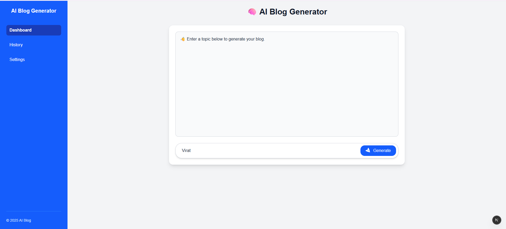
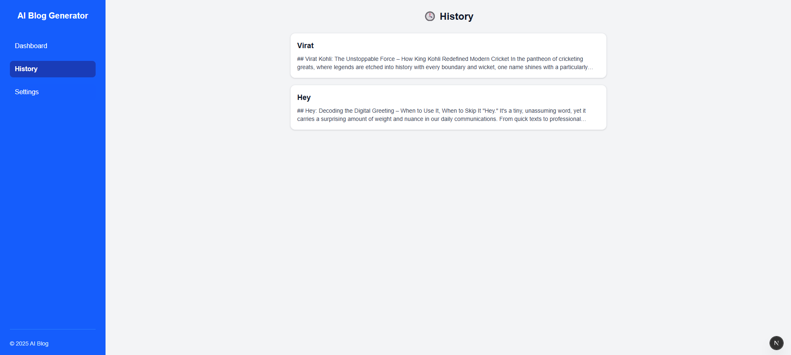

🧠 AI Blog Generator (Next.js + Gemini AI)

A powerful AI-powered blog generator built with Next.js 15, Tailwind CSS, and Google Gemini API.
Enter a topic, and the app will automatically generate a detailed, SEO-friendly blog post with an engaging tone.

🚀 Features

Generate full-length blogs using Google Gemini AI ✅
Start / Stop generation anytime ✅
Auto-typing animation for generated content ✅
Scrollable card output ✅
Sidebar with Dashboard, History, and Settings ✅
Click any previous topic from History to view it again ✅
Clean responsive UI built with Tailwind CSS ✅
Simple Node.js API route integration ✅

🏗️ Tech Stack
Layer	Technology
Framework	Next.js 15

Styling	Tailwind CSS

AI Model	Google Gemini 2.5 Flash

Language	JavaScript / React
Package Manager	npm or yarn
📁 Folder Structure
ai-blog-generator/
│
├── app/
│   ├── api/
│   │   └── generate/
│   │       └── route.js         # API route for blog generation
│   ├── page.js                   # Main page (UI + logic)
│
├── components/
│   └── Sidebar.jsx               # Sidebar component
│
├── lib/
│   └── api.js                    # Frontend fetch logic for API
│
├── .env.local                    # Your environment variables
├── package.json
├── tailwind.config.js
├── postcss.config.js
└── README.md

⚙️ Installation & Setup

Follow these steps to run the project locally 👇

1️⃣ Clone the Repository
git clone https://github.com/<your-username>/ai-blog-generator.git
cd ai-blog-generator

2️⃣ Install Dependencies
npm install

3️⃣ Add Environment Variable

Create a .env.local file in the project root and add:

NEXT_PUBLIC_GEMINI_API_KEY=your_google_gemini_api_key_here

👉 You can get your API key from: Google AI Studio

4️⃣ Run the Development Server
npm run dev

Then open 👉 http://localhost:3000
 in your browser.

🧩 API Endpoint
POST /api/generate

Request Body:

{
  "topic": "Benefits of AI in Education"
}

Response:

{
  "content": "Full AI-generated blog content here..."
}

🛠️ Key Files
📄 src/lib/api.js

Handles communication with the backend API.

export const generateBlog = async (topic, controller) => {
  const response = await fetch("/api/generate", {
    method: "POST",
    headers: { "Content-Type": "application/json" },
    body: JSON.stringify({ topic }),
    signal: controller?.signal,
  });

  if (!response.ok) {
    const error = await response.json();
    throw new Error(error.error || "Failed to generate blog");
  }

  const data = await response.json();
  return data.content;
};

📄 app/api/generate/route.js

Server-side route for generating blogs using Gemini.

import { GoogleGenerativeAI } from "@google/generative-ai";
export const runtime = "nodejs";

export async function POST(req) {
  try {
    const { topic } = await req.json();

    if (!topic || topic.trim() === "")
      return Response.json({ error: "Topic is required" }, { status: 400 });

    const genAI = new GoogleGenerativeAI(process.env.NEXT_PUBLIC_GEMINI_API_KEY);
    const model = genAI.getGenerativeModel({ model: "gemini-2.5-flash" });

    const prompt = `Write a detailed, engaging, and SEO-friendly blog post about: "${topic}". Include an introduction, 3–4 main sections, and a conclusion.`;

    const result = await model.generateContent(prompt);
    const text = result.response.text();

    return Response.json({ content: text }, { status: 200 });
  } catch (error) {
    console.error("❌ Error generating blog:", error);
    return Response.json(
      { error: "Failed to generate blog", details: error.message },
      { status: 500 }
    );
  }
}

📄 app/page.js

Main page UI with sidebar, start/stop button, history, and blog display.

(Already tested and working version — see your final page.js from previous response.)

🧠 Usage

Run the app with npm run dev

Enter a topic in the input box (e.g. “The Future of AI in Healthcare”)

Click Generate

Watch the blog appear word-by-word ✨

Stop generation anytime with the Stop button

Switch to History to see all past blogs

🧾 Troubleshooting
Problem	Solution
Topic is required	Ensure your JSON body includes { "topic": "..." }.
Invalid JSON body	Double-check your fetch request has Content-Type: application/json.
Failed to generate blog	Verify your Gemini API key is valid in .env.local.
Blank output	Refresh the page and try again — sometimes Gemini API throttles temporarily.
🌐 Deployment

You can easily deploy on Vercel:

Push code to GitHub

Go to vercel.com

Import your repository

Add environment variable:

NEXT_PUBLIC_GEMINI_API_KEY

Click Deploy

💙 Author

👤 Raj Sharma
📧 rajsharma74411@gmail.com

💼 MERN Stack Developer | Frontend Specialist
🔗 LinkedIn
 • GitHub

🪪 License

This project is licensed under the MIT License — free to use, modify, and distribute.

